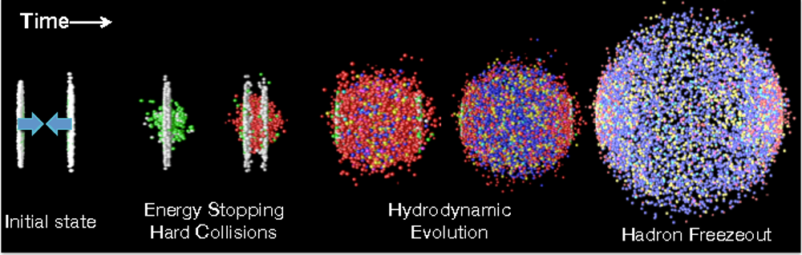

# avgicTVUD

### Trento + Vishnu + Urqmd + Dreena  -  averaged initial conditions

<h1></h1>

This is a package for full heavy-ion collision simulation performed on averaged initial conditions. It contains TRENTO initial conditions,
VISHNew hydro code, UrQMD afterburner and DREENA-A model for high-pT energy loss calculations.